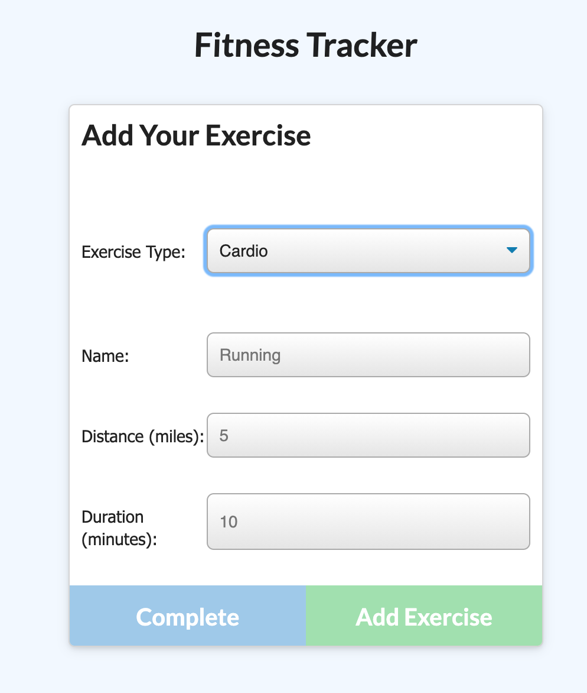
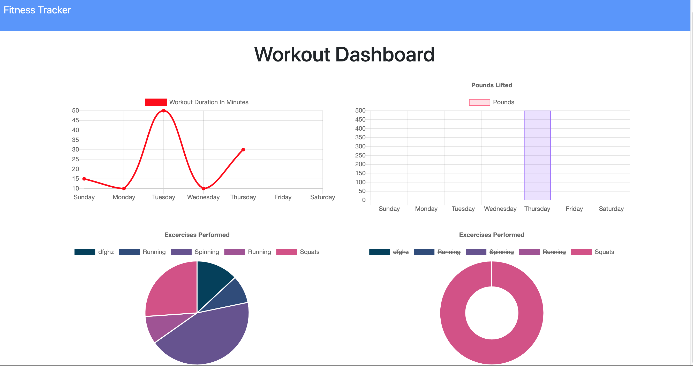

# FitnessTracker

  
  
  
  # FitAF Fitness Tracker
  ## Description
  #### As a user, I am able to create a new workout, or resume an existing workout, then I can see the progress I have made in the form of charts and graphs. I can choose either a resistance or a cardio workout and the form that shows up with adjust accordingly. The app will then display my last workout on the homepage and ask if I would like to continue with that workout, or create a new one. I am also able to view the combined weight of multiple exercises on the stats page.
  # Table of Contents
   * [Installation](#installation)
   * [Usage](#usage)
   * [License](#license)
   * [Contributors](#contributors)
   * [Tests](#tests)
   * [Questions](#questions)
  ## Installation
  #### node.js, mongoose, express, logger, mongo Atlas
  ## Usage
  #### Play video to see deployed app: https://drive.google.com/file/d/1pRgazbBGN4q9eXxEc3iH-xDpCzJOU8wt/view
  #### Try it for yourself on Heroku: https://kafitnesstracker.herokuapp.com/stats
  
  
  

  ## License
  #### This project is licensed under the MIT license.
  ## Contributing
  #### 
  ## Questions
  #### Email: <a>kanilionis@gmail.com</a>
  #### GitHub: <a>github.com/kanilionis</a>
  

